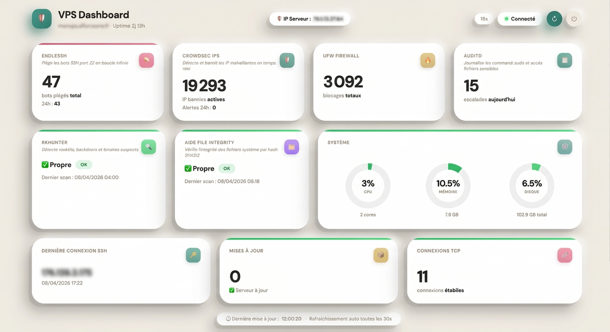

⚡ 78 bots bloqués en 24h sur un VPS standard - le tien est-il protégé ?

# 🔐 VPS-secure

**🔐 Sécurise ton VPS en 15 min - honeypot, pare-feu, IPS, integrity monitoring. Une commande. Zéro compétence requise.**


> "Si tu fais tourner n8n, openclaw, ou ton propre SaaS sur un serveur de type VPS, lance ce script **AVANT D'INSTALLER QUOI QUE CE SOIT.**
>
>
> 15 minutes, une seule commande. Ton serveur passe du stade *cible facile* à *cible qui n'en vaut pas la peine*."

## 🛡️ Pourquoi utiliser ce script ?

> **Le constat est simple :** les protections par défaut fournies par les hébergeurs (OVH, Hostinger, Hetzner, DigitalOcean, etc.) sont **insuffisantes** pour une mise en production sécurisée.

| | |
|---|---|
| **Le problème** | Un VPS livré "nu" tourne avec l'utilisateur `root` ouvert sur le port 22, sans firewall configuré et sans aucun système de détection d'intrusion. |
| **Le risque** | Les bots et scanners automatiques trouvent ton IP et tentent des attaques par force brute en **moins de 2 minutes** après l'activation du serveur. |
| **La solution** | En **15 minutes**, ce script installe une stack complète clé en main — pare-feu UFW, IPS CrowdSec, honeypot Endlessh, integrity monitoring AIDE, audit système, DNS chiffré, hardening kernel — et configure des alertes Telegram en temps réel. |

Je m'appelle Fabrice, entrepreneur avec plusieurs SaaS à mon actif, et c'est précisément la configuration que j'utilise pour sécuriser mes serveurs de production.

**Choisis VPS-SECURE pour que ton serveur devienne une forteresse prête à accueillir tes services en toute sécurité.**

---

<p align="center">
  
</p>

---

## Ce que fait `install.sh`

15 étapes automatiques, zéro compétence technique requise.

| # | Quoi | Pourquoi |
|---|---|---|
| 1 | Crée l'utilisateur `vpsadmin` | Fini le root — impossible de faire une erreur fatale |
| 2 | SSH port 2222, clé uniquement | Port 22 scanné en permanence par des bots — on déménage. Connexion limitée à `vpsadmin` uniquement |
| 3 | Mise à jour système + DNS chiffré + `/tmp`, `/var/tmp` et `/dev/shm` sécurisés | Ferme les failles connues. DNS over TLS activé **avant** tout téléchargement — élimine la fenêtre de DNS poisoning. `/tmp`, `/var/tmp` et `/dev/shm` montés `noexec` — les scripts malveillants ne peuvent pas s'y exécuter |
| 4 | **CrowdSec** | Détecte et bannit les IP malveillantes. Installé via dépôt GPG signé avec vérification d'empreinte — intégrité vérifiée |
| 5 | **UFW** (pare-feu) | Tout bloqué sauf les ports 2222, 80 et 443. Le forwarding Docker est ciblé — pas global |
| 6 | **Docker** Engine + Compose v2 | Docker permet de faire tourner des applications dans des "boîtes isolées" (containers). Configuré pour ne **pas** bypasser UFW — les ports exposés restent sous contrôle du pare-feu. Règle NAT ajoutée dans UFW — les containers ont accès à internet |
| 7 | unattended-upgrades | Patches de sécurité installés automatiquement chaque nuit |
| 8 | Kernel hardening | 33 paramètres : réseau (spoofing, SYN flood, ICMP, redirections sécurisées) + ASLR + protection ptrace + core dumps désactivés + perf events restreints |
| 9 | **auditd** | Journalise tout : SSH, sudo, Docker, fichiers sensibles, crontabs (vecteur de persistence) et `/etc/hosts` (MITM DNS local) |
| 10 | Swap 2 GB | Mémoire virtuelle d'urgence — évite les crashs |
| 11 | **rkhunter** | Scanne les backdoors et rootkits. Scan quotidien automatique à 04h00 — indépendant de Telegram |
| 12 | Désactivation des services inutiles | avahi, cups, bluetooth, ModemManager désactivés — chaque service actif = surface d'attaque (CIS 2.x). Ctrl-Alt-Delete masqué (DISA STIG) |
| 13 | Alertes **Telegram** | Rapport de sécurité quotidien + alerte immédiate à chaque connexion SSH — optionnel |
| 14 | **Endlessh** (honeypot port 22) | SSH est sur le port 2222 — le port 22 est libre. Endlessh le capture et maintient les bots connectés des heures en leur envoyant un banner SSH infini. Ils ne peuvent pas attaquer ailleurs pendant ce temps |
| 15 | **AIDE** (integrity monitoring) | Hash SHA512 de tous les binaires système à l'installation. Scan quotidien à 03h00 — toute modification (binaire remplacé, backdoor, rootkit) déclenche une alerte dans le rapport Telegram de 07h00. Les mises à jour automatiques (`unattended-upgrades`) sont détectées et la baseline est mise à jour silencieusement — zéro fausse alerte |

---

## Prérequis

Avant de commencer, tu as besoin de :

- ✅ Un VPS vierge **Ubuntu 24.04 LTS** (Hostinger, Hetzner,…)
- ✅ L'**IP** et le **mot de passe root** fournis par ton hébergeur
- ✅ Une **clé SSH** générée sur ton ordinateur

> 💡 Pas encore de VPS ? [-20% sur Hostinger avec le code **WP7SERVERWR1**](https://www.hostinger.com/fr?REFERRALCODE=WP7SERVERWR1) · ou · [20€ offerts sur Hetzner](https://hetzner.cloud/?ref=9x8yLdZS8Btd) — recommandé : CPX21 (4 GB RAM · 9,99€/mois) ou CPX32 (8 GB RAM · 14,49€/mois)

---

## Installation

### Étape 0 — Utilise le guide interactif (recommandé)

Avant de commencer, ouvre le [Guide d'installation interactif](https://guide-vps-secure.netlify.app/) et suit les indications.

Il te permet de :
- Noter ton IP et ta clé SSH au même endroit
- Exporter ta config en `.txt` ou `.pdf`
- Déverrouiller la commande de lancement quand tout est prêt

> 💡 Ouvre le [guide d'installation](https://guide-vps-secure.netlify.app/) depuis ton navigateur.

### Étape 1 — Génère ta clé SSH (sur ton ordinateur)

Ouvre un terminal sur ton ordinateur :
- **Mac** → Spotlight (`Cmd+Espace`) → tape `Terminal` → Entrée
- **Windows** → touche `Windows` → tape `Windows Terminal` ou `PowerShell` → Entrée
- **Linux** → `Ctrl+Alt+T`

Puis lance cette commande :
```bash
ssh-keygen -t ed25519 -f ~/.ssh/id_ed25519_vps
```

Appuie sur Entrée 3 fois (pas besoin de mot de passe).

Récupère la clé publique — tu en auras besoin pendant le script :
```bash
cat ~/.ssh/id_ed25519_vps.pub
```

Copie la ligne qui s'affiche (elle commence par `ssh-ed25519`).

### Étape 2 — Connecte-toi en root

> 💡 Si tu as déjà utilisé cette IP (rebuild VPS), supprime l'ancienne clé connue :
> ```bash
> ssh-keygen -R IP_DU_VPS
> ```
Puis
```bash
ssh root@IP_DU_VPS
```

Remplace `IP_DU_VPS` par l'IP que tu as notée dans le guide interactif.

Le serveur va te demander un mot de passe — c'est le mot de passe root fourni par ton hébergeur par email après provisioning.

> 💡 C'est la seule fois où ce mot de passe est utilisé. Après l'installation, la connexion root par mot de passe est définitivement désactivée.

### Étape 3 — Lance le script

```bash
curl -O https://raw.githubusercontent.com/rockballslab/vps-secure/main/install.sh
chmod +x install.sh && ./install.sh
```

Le script est interactif. Il te pose **2 questions obligatoires** :

1. Ta clé SSH publique (colle le contenu de `id_ed25519_vps.pub`)
2. Confirme que la connexion fonctionne depuis un 2ème terminal

Et **1 question optionnelle** à la fin : configurer les alertes Telegram.

À la toute fin, le script affiche la commande pour te reconnecter et la commande de vérification — puis attend que tu appuies sur Entrée avant de redémarrer. Prends le temps de les noter.

> ⚠️ **Ne ferme pas cette session root avant que le script te le demande.**
> Il vérifie lui-même que tu peux te reconnecter avant de désactiver root.

### Étape 4 — Reconnecte-toi en vpsadmin (après le redémarrage)

```bash
ssh vpsadmin@IP_DU_VPS -p 2222 -i ~/.ssh/id_ed25519_vps
```

### Étape 5 — Vérifie l'installation

Le script t'a affiché cette commande à la fin — lance-la maintenant :

```bash
sudo vps-secure-verify
```

Chaque composant retourne `[PASS]` ou `[FAIL]` avec la raison. Tout doit être PASS.

C'est tout. Le VPS est sécurisé.

---

## Alertes de sécurité sur Telegram (optionnel)

À la fin de l'installation, le script te propose de configurer deux niveaux d'alertes :

- **Rapport quotidien à 07h00** — état global du serveur (CrowdSec, rkhunter, auditd)
- **Alerte immédiate** — notification Telegram à chaque connexion SSH réussie (utilisateur + IP source)

**Ce dont tu as besoin :**
1. Crée un bot → ouvre [@BotFather](https://t.me/BotFather) → `/newbot` → copie le token
2. Récupère ton chat ID → ouvre [@userinfobot](https://t.me/userinfobot) → `/start` → copie l'`id`

**Ce que tu reçois chaque matin à 07h00 :**

```
🔐 vps-secure — Rapport quotidien
📅 05/04/2026 · monvps

✅ Tout va bien sur ton VPS

✅ CrowdSec : aucune alerte
✅ rkhunter : aucune anomalie
✅ auditd : aucun événement critique
🍯 Endlessh : 247 bot(s) piégé(s) en 24h
✅ AIDE : aucune modification système détectée

Aucune action requise.
```

**Ce que tu reçois à chaque connexion SSH :**

```
🔐 Connexion SSH sur monvps
👤 Utilisateur : vpsadmin
🌐 IP source   : 92.184.x.x
📅 05/04/2026 14:32:17
```

Si une anomalie est détectée dans le rapport quotidien, le message inclut le détail et la commande exacte pour réparer.

> Tu as passé cette étape ? Relance `./install.sh` pour la configurer plus tard.

---

## ⚠️ Docker & Firewall : Sécurité Garantie

Par défaut, Docker ignore les règles de votre pare-feu (UFW) et expose vos ports directement sur Internet. Ce script corrige cette faille critique.

- Le correctif : Le script désactive la gestion automatique d'iptables par Docker.

- Accès Internet : Une règle de NAT (MASQUERADE) est automatiquement ajoutée à before.rules pour que vos containers conservent un accès à Internet.

- Contrôle Total : Rien ne sort, rien ne rentre sans votre accord.


**Ce que ça change concrètement :** Si vous lancez un container sur le port 8080, il restera **invisible** depuis l'extérieur. Pour l'ouvrir, vous devrez le faire manuellement :

```bash
sudo ufw allow 8080/tcp comment 'Mon application'
```

---

## 🛡️ Niveau de sécurité

Ce script couvre environ **80% du CIS Benchmark Ubuntu 24.04 Level 1** et **70% du DISA STIG Ubuntu 24.04** — largement au-dessus de n'importe quel script public comparable.


| Standard | Couverture |
|---|---|
| CIS Benchmark L1 | ~80% |
| DISA STIG Ubuntu 24.04 | ~70% |
| OWASP Infrastructure | Supply chain (GPG + empreinte vérifiée), secrets, logging |
| Lynis Audit | 78/100 |  la moyenne des serveurs Ubuntu non configurés est 54 |

**CIS Benchmark** — CIS = Center for Internet Security, organisation américaine à but non lucratif qui publie des guides de configuration sécurisée pour tous les OS majeurs. Le Level 1 cible une sécurité raisonnable sans impact sur les fonctionnalités — c'est le standard utilisé par les entreprises pour leurs serveurs en production. 80% CIS L1 signifie 4 contrôles sur 5 couverts. Les 20% restants sont des contrôles non applicables sur VPS (partitions dédiées `/var`, `/home`) ou volontairement exclus pour garder le script accessible.

**DISA STIG** — DISA = Defense Information Systems Agency, l'agence IT du Département de la Défense américain. Les STIGs sont leurs guides de configuration, plus stricts que CIS, obligatoires pour tous les systèmes du gouvernement US. 70% DISA STIG est très bon pour un script public — les 30% restants concernent des contrôles militaires sans sens pour un VPS perso (accès physique, smartcard auth) ou nécessitant une infrastructure d'entreprise (LDAP, SIEM centralisé).

**Lynis** - outil d'audit de sécurité Linux open-source = Il scanne la configuration du serveur et donne un score sur 100. Référence industrie, utilisé par les sysadmins professionnels.


## Sécurité de l'utilisateur vpsadmin

Le script crée un utilisateur dédié (vpsadmin) pour gérer votre serveur. Voici ce qu'il faut savoir sur ses pouvoirs :

- ⚡ Sudo simplifié : vpsadmin peut exécuter des commandes d'administration sans taper son mot de passe à chaque fois. Pour éviter les piratages de terminal, une sécurité supplémentaire (use_pty) a été ajoutée.

- 🐳 Docker = Pouvoir Root : Comme vpsadmin peut lancer Docker, il peut techniquement accéder à tout le serveur. C'est normal et nécessaire pour gérer vos containers facilement.

>⚠️ La règle d'or : Protégez votre clé SSH !
>Puisque vpsadmin a de grands pouvoirs, celui qui possède votre clé privée SSH possède votre serveur.
> - Ne stockez jamais votre clé privée sur un Cloud (Drive, Dropbox).
> - Ne la partagez jamais.

---

## Ce que ce script ne fait PAS

- ❌ Pas de déploiement d'applications (n8n, WordPress, etc).
Le script prépare une infrastructure ultra-sécurisée. Une fois le script passé, votre serveur est une forteresse prête à accueillir vos services. À vous d'installer vos apps, elles bénéficieront automatiquement de la protection du système (Firewall, Fail2Ban, etc.).

- ⚠️ Pas de gestion HTTPS pour vos futurs sites.
Le script ne devine pas vos noms de domaine. Pour mettre vos propres sites en HTTPS (cadenas vert), vous devrez simplement installer un Reverse Proxy (comme Caddy, Nginx Proxy Manager ou Traefik).

> Note : Si vous choisissez l'option Dashboard, le HTTPS est géré automatiquement pour vous avec un Reverse Proxy Caddy.

---

## Commandes utiles après installation

```bash
# Vérification post-installation — PASS / FAIL par composant
sudo vps-secure-verify
```

```
  [PASS] SSH          : port 2222 actif · root désactivé · PasswordAuth off · socket override OK
  [PASS] UFW          : actif · ports 2222/80/443 ouverts · règle NAT Docker présente · logging medium
  [PASS] CrowdSec     : actif · bouncer actif · port 8081 · 2 collection(s)
  [PASS] Docker       : actif · v29.3.1 · iptables:false confirmé
  [PASS] Endlessh     : container actif · port 22 en écoute · règle UFW présente
  [PASS] AIDE         : baseline présente (âge : 0j) · cron 03h00 configuré
  [PASS] rkhunter     : installé · baseline présente · conf.local OK · cron 04h00 · dernier scan : jamais
  [PASS] auditd       : actif · 26 règle(s) chargée(s)
  [PASS] Swap         : actif · 2048 MB · swappiness=10
  [PASS] Kernel       : ASLR=2 · ptrace_scope=1 · syncookies=1 · ip_forward=1 · suid_dumpable=0 · dmesg/kptr/eBPF restreints
  [PASS] DNS over TLS : systemd-resolved actif · DoT=yes · serveur principal : 9.9.9.9
  [PASS] Telegram     : config présente · API OK · bot : @monbot

  ✅ Installation 100% complète — tous les composants sont opérationnels.
```

> Retourne exit code 0 si tout PASS, 1 si au moins un FAIL — utilisable depuis un script de monitoring externe.

```bash
# Tableau de bord de sécurité instantané
sudo vps-secure-stats
```

```
╔══════════════════════════════════════════════════════╗
║          vps-secure — Tableau de bord                ║
╚══════════════════════════════════════════════════════╝
  monvps · 05/04/2026 07:00

  🍯 HONEYPOT (Endlessh)          actif
     Bots piégés (24h)     : 247
     Bots piégés (total)   : 1834

  🛡️  CROWDSEC                     actif
     IP bannies actives    : 97
     Alertes (24h)         : 12

  🔥 PARE-FEU (UFW)
     Blocages totaux       : 4521

  📋 AUDIT (auditd)
     Escalades privilèges  : 1247 aujourd'hui

  🔍 ROOTKITS (rkhunter)          OK
     Dernier scan          : 2026-04-05 04:00:01

  🔐 INTÉGRITÉ (AIDE)
     Dernier scan          : Aucune modification

  💻 SYSTÈME
     Uptime                : 3 weeks, 2 days
     Charge                : 0.08, 0.12, 0.09
     Mémoire               : 1.2Gi / 3.8Gi
```


> ⓘ Le jour de l'installation, les escalades de privilèges affichent un nombre élevé (1000+).
> C'est normal — le script install.sh tourne en root et chaque commande système est auditée.
> Dès le lendemain, le compteur reflète uniquement tes actions réelles.


```bash
# Voir les alertes CrowdSec (dernières 24h)
sudo cscli alerts list --since 24h

# Consulter les logs d'audit
sudo ausearch -k privilege_escalation --start today -i
sudo ausearch -k docker_socket --start today -i
sudo aureport --summary

# Lancer un scan de rootkits
sudo rkhunter --check --report-warnings-only

# Voir le log du scan rkhunter quotidien (04h00)
sudo cat /var/log/rkhunter-cron.log

# Statut du pare-feu
sudo ufw status verbose

# Vérifier les ports exposés par Docker
sudo docker ps --format "table {{.Names}}\t{{.Ports}}"

# Tester le rapport Telegram manuellement (si Telegram a été activé)
sudo /usr/local/bin/vps-secure-check.sh

# Honeypot Endlessh — stats des bots piégés (cache mis à jour toutes les 5 min)
cat /var/cache/vps-secure/security-stats.json

# Honeypot Endlessh — logs en direct
sudo docker logs -f endlessh

# AIDE — lancer un scan d'intégrité manuellement
sudo aide --check

# AIDE — mettre à jour la baseline après une mise à jour OS majeure (upgrade de version)
# Note : les patches de sécurité quotidiens (unattended-upgrades) sont gérés automatiquement
sudo aide --update && sudo cp /var/lib/aide/aide.db.new /var/lib/aide/aide.db

# Cache sécurité (Endlessh + CrowdSec) — mis à jour toutes les 5 min
cat /var/cache/vps-secure/security-stats.json
```

---
## OPTIONNEL mais pratique

## Connexion rapide (optionnel)

Ajoute ceci sur **ton ordinateur** dans `~/.ssh/config` :
```
Host monvps
    HostName IP_DU_VPS
    User vpsadmin
    Port 2222
    IdentityFile ~/.ssh/id_ed25519_vps
```

Ensuite tu te connectes avec juste :
```bash
ssh monvps
```


## Dashboard de monitoring (optionnel)
 
 Un dashboard web pour visualiser en temps réel l'état de ton serveur : bots piégés, IP bannies, blocages UFW, statut AIDE/rkhunter, charge système.
 
Accessible depuis un navigateur, protégé par une page de connexion, déployé en Docker. CrowdSec et Endlessh sont détectés automatiquement.
```bash
 curl -O https://raw.githubusercontent.com/rockballslab/vps-secure/main/dashboard/install-dashboard.sh
 chmod +x install-dashboard.sh && ./install-dashboard.sh
```


<p align="center">
  
</p>


Le script te demande un domaine et un mot de passe, configure tout et lance automatiquement. Ton mot de passe est sauvegardé dans `~/vps-monitor/.env`.
 
> Prérequis : un enregistrement DNS A pointant sur l'IP de ton VPS · ports 80/443 déjà ouverts par `install.sh`

> 💡 Pour générer un mot de passe sécurisé depuis ton terminal ou ton serveur : `openssl rand -base64 32`

---

## Compatibilité

Testé et vérifié le 11 Avril 2026 sur **Ubuntu 24.04 LTS** — Hostinger KVM2, KVM4 · Hetzner CX · Installation complète en 13 min ·

---

## Licence

MIT — libre d'utilisation, de modification et de redistribution.

---

*Fait avec ❤️ par Fabrice [@rockballslab](https://github.com/rockballslab)*
