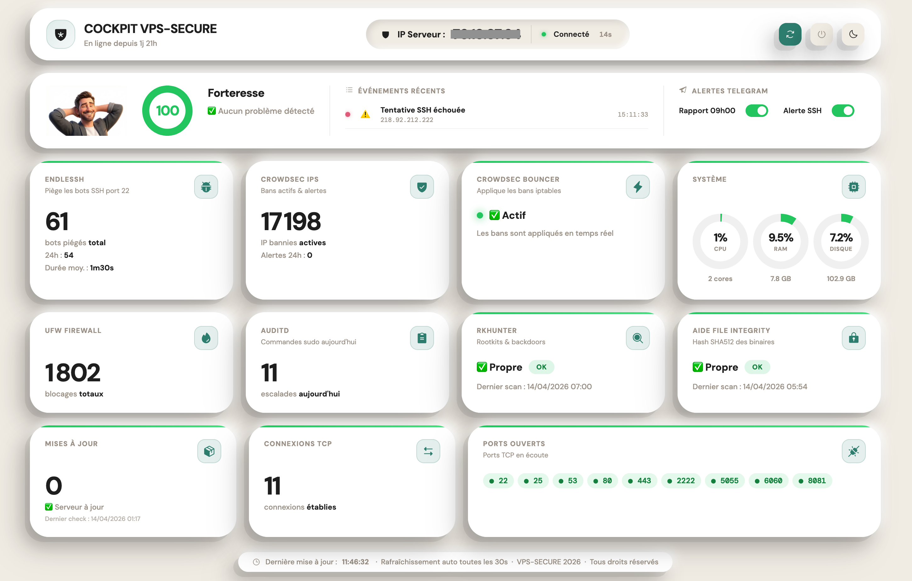
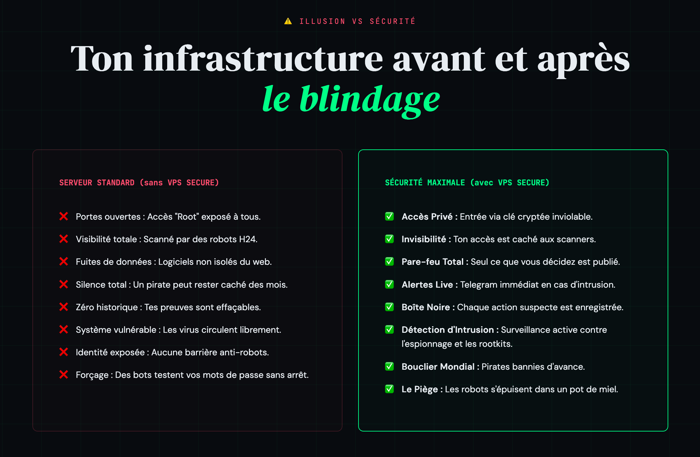
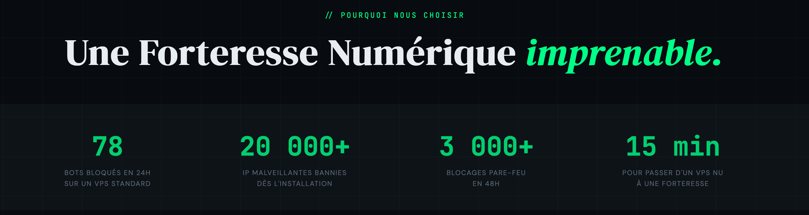
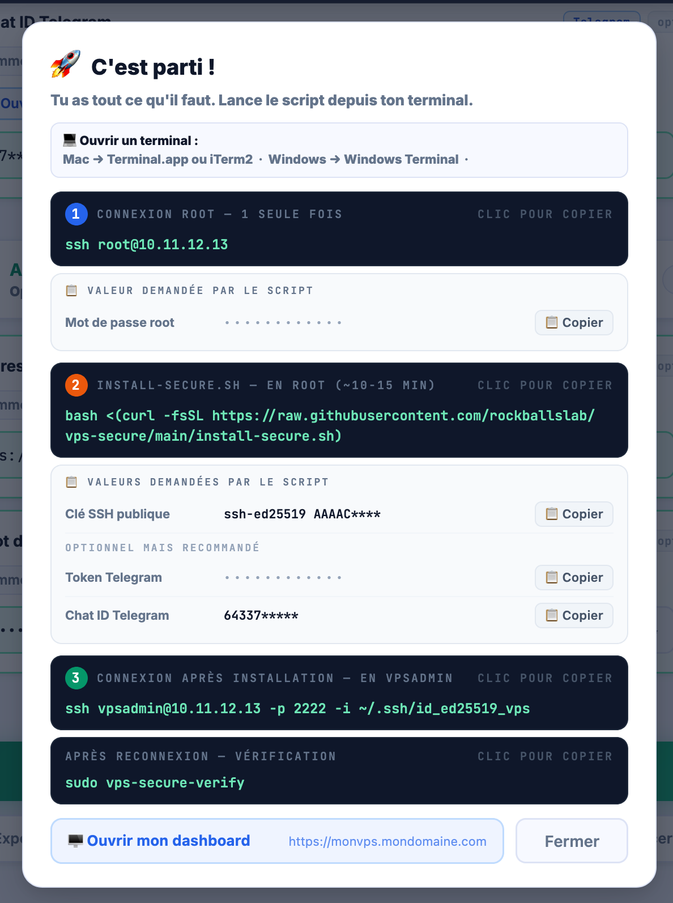
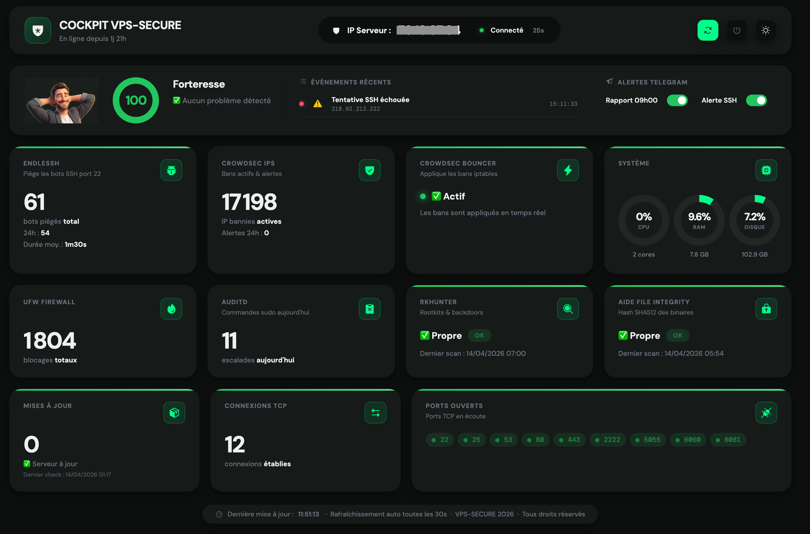

**⚡ +60 bots bloqués en 24h sur un VPS standard - le tien est-il vraiment protégé ?**

# VPS-SECURE

**🔐 Sécurise ton serveur en moins de 15 min - honeypot, pare-feu, IPS, integrity monitoring. Une commande.** **Zéro compétence requise.**


> "Si tu fais tourner n8n, openclaw, ou ton propre SaaS sur un VPS, et que tu tiens à tes données, lance ce script **AVANT D'INSTALLER QUOI QUE CE SOIT.**"


**15 minutes**, une seule commande pour que ton serveur devienne une **Forteresse** prête à accueillir tes services en toute sérennité.

```bash
curl -fsSL https://raw.githubusercontent.com/rockballslab/vps-secure/main/install-secure.sh -o install-secure.sh \
  && chmod +x install-secure.sh \
  && sudo ./install-secure.sh
```

---

## 🛡️ Pourquoi choisir ce script ?

Un serveur nu ou configuré par défaut est une cible facile, visible et attaquable en quelques minutes.

**VPS-Secure** n’est pas un simple script d’installation : c’est une fondation de sécurité ultra robuste, pensée pour transformer un VPS nu en serveur prêt à l’emploi et nettement mieux protégé contre les attaquants.


<p align="center">
  
</p>


---


## Qui suis-je ?

👋 Hello, moi c'est Fabrice.
Entrepreneur, fondateur de plusieurs SaaS et adepte du "Zero Trust".


J'ai conçu **VPS-SECURE** par nécessité : je voulais un outil capable de transformer n'importe quel serveur brut en une forteresse imprenable en quelques minutes, sans sacrifier la stabilité de mes services.


> *"Eat your own dog food"* : C'est précisément la configuration que j'utilise pour blinder mes serveurs de production et tester de nouveaux services (comme OpenClaw) avec une tranquillité d'esprit absolue.

---


## Exemple du Dashboard inclus - 61 bots m'auraient déjà attaqué en 24H sans VPS-SECURE pour me protéger

Un cockpit web complet et sécurisé pour visualiser en temps réel l'état de ton serveur :
bots piégés, IP bannies, blocages UFW, intégrité systeme, détection de rootkits, charge CPU RAM, alertes Telegram.


 <p align="center">
  
</p>


---


## Ce que fait VPS-SECURE

1 commande - 15 étapes automatiques - zéro compétence technique requise.

| # | Quoi | Pourquoi |
|---|---|---|
| 1 | Crée l'utilisateur `vpsadmin` | Fini le root - impossible de faire une erreur fatale |
| 2 | SSH port 2222, clé uniquement | ... Connexion limitée à `vpsadmin` uniquement. **GSSAPI désactivé** (CVE-2026-3497) |
| 3 | Mise à jour système + DNS chiffré + `/tmp`, `/var/tmp` et `/dev/shm` sécurisés | Ferme les failles connues. DNS over TLS activé **avant** tout téléchargement - élimine la fenêtre de DNS poisoning. `/tmp`, `/var/tmp` et `/dev/shm` montés `noexec` - les scripts malveillants ne peuvent pas s'y exécuter |
| 4 | **CrowdSec** | Détecte et bannit les IP malveillantes. Installé via dépôt GPG signé avec vérification d'empreinte - intégrité vérifiée |
| 5 | **UFW** (pare-feu) | Tout bloqué sauf les ports 2222, 80 et 443. Le forwarding Docker est ciblé - pas global |
| 6 | **Docker** Engine + Compose v2 | Docker permet de faire tourner des applications dans des "boîtes isolées" (containers). Configuré pour ne **pas** bypasser UFW - les ports exposés restent sous contrôle du pare-feu. Règle NAT ajoutée dans UFW - les containers ont accès à internet |
| 7 | unattended-upgrades | Patches de sécurité installés automatiquement chaque nuit. **Docker CE** inclus dans les mises à jour automatiques. **snapd blacklisté** (CVE-2026-3888) |
| 8 | Kernel hardening | **35 paramètres** : réseau (spoofing, SYN flood, ICMP...) + ASLR + ptrace + core dumps + perf events + **AppArmor userns restriction (CIS compliance)** |
| 9 | **auditd** | Journalise tout : SSH, sudo, Docker, fichiers sensibles, crontabs, `/etc/hosts`. **Surveillance anti-rootkit eBPF/LKM** (VoidLink) au niveau syscall. Scan quotidien `voidlink-detect` à 02h30 |
| 10 | Swap 2 GB | Mémoire virtuelle d'urgence - évite les crashs |
| 11 | **rkhunter** | Scanne les backdoors et rootkits. Scan quotidien automatique à **00h00 UTC (02h00 Paris)** - indépendant de Telegram |
| 12 | Désactivation des services inutiles | avahi, cups, bluetooth, ModemManager désactivés - chaque service actif = surface d'attaque (CIS 2.x). Ctrl-Alt-Delete masqué (DISA STIG) |
| 13 | Alertes **Telegram** | Rapport de sécurité quotidien + Alerte immédiate à chaque connexion SSH |
| 14 | **Endlessh** (honeypot port 22) | SSH est sur le port 2222 - le port 22 est libre. Endlessh le capture et maintient les bots connectés des heures en leur envoyant un banner SSH infini. Ils ne peuvent pas attaquer ailleurs pendant ce temps |
| 15 | **AIDE** (integrity monitoring) | Hash SHA512 de tous les binaires système à l'installation. Scan quotidien à 03h00 - toute modification (binaire remplacé, backdoor, rootkit) déclenche une alerte dans le rapport Telegram. Après une mise à jour OS, relancer la baseline manuellement (commande fournie). |


<p align="center">
  
</p>


<p align="center">
  
</p>


---


## Prérequis

Avant de commencer et de lancer le script, tu as besoin de :

- ✅ Un VPS vierge **Ubuntu 24.04 LTS** (Hostinger, Hetzner, OVH,…)
- ✅ L'**IP** et le **mot de passe root** fournis par ton hébergeur
- ✅ Une **clé SSH** générée sur ton ordinateur


> [!NOTE]
> 🔑 Ce script nécessite une licence - [disponible ici](https://vps-secure.aiforceone.fr/offre.html) - **OFFRE DE LANCEMENT 47€** au lieu de 97€ avec le code **REDUC50**
>
> 👨‍💻 Tu souhaites contribuer et auditer le code ? [Contacte-moi pour un accès Bêta](https://tally.so/r/lblb0k) - ta clé d'activation unique sera envoyée en quelques minutes.


---


# Installation en 15mn chrono

### Étape 0 - Utilise le guide interactif (recommandé)

Avant de commencer, ouvre le [Guide d'installation interactif](https://vps-secure.aiforceone.fr/guide.html) et suis les indications pas à pas.

Il te permet de centraliser toutes les infos demandées pendant l'installation - zéro copier-coller raté.

> [!TIP]
> Pas encore de VPS ? [-20% sur Hostinger avec le code **WP7SERVERWR1**](https://www.hostinger.com/fr?REFERRALCODE=WP7SERVERWR1) · ou · [20€ offerts sur Hetzner](https://hetzner.cloud/?ref=9x8yLdZS8Btd)

---

### Étape 1 - Génère ta clé SSH (sur ton ordinateur)

Ouvre un terminal sur ton ordinateur :
- **Mac** → Spotlight (`Cmd+Espace`) → tape `Terminal` → Entrée
- **Windows** → touche `Windows` → tape `Windows Terminal` ou `PowerShell` → Entrée

Puis lance cette commande :
```bash
ssh-keygen -t ed25519 -f ~/.ssh/id_ed25519_vps
```

Appuie sur Entrée 3 fois (pas besoin de mot de passe).

Récupère la clé publique en lançant cette commande - tu en auras besoin pendant le script :
```bash
cat ~/.ssh/id_ed25519_vps.pub
```

Copie le résultat qui s'affiche (elle commence par `ssh-ed25519`) et colle-la dans le [Guide d'installation](https://vps-secure.aiforceone.fr/guide.html)

---

### Étape 2 - Connecte-toi en root

```bash
ssh root@IP_DU_VPS
```

Remplace `IP_DU_VPS` par l'IP que tu as notée dans le guide interactif.

Le serveur va te demander un mot de passe - c'est le mot de passe root fourni par ton hébergeur par email après provisioning.

> [!TIP]
> C'est la seule fois où ce mot de passe est utilisé. Après l'installation, la connexion root par mot de passe est définitivement désactivée.


> [!TIP]
> Si tu as déjà utilisé cette IP (rebuild VPS précédent), supprime l'ancienne clé connue avant de te connecter :
> ```bash
> ssh-keygen -R IP_DU_VPS
> ```

---

### Étape 3 - Lance le script

```bash
curl -fsSL https://raw.githubusercontent.com/rockballslab/vps-secure/main/install-secure.sh -o install-secure.sh \
  && chmod +x install-secure.sh \
  && sudo ./install-secure.sh
```

> [!IMPORTANT]
> **`install-secure.sh`** vérifie la signature GPG de `install.sh` avant de le lancer.
> C'est la commande recommandée - elle garantit que le script n'a pas été altéré.


Le script est interactif. Il te pose **3 questions obligatoires** au début de l'installation :

1. Ta clé d'activation (reçue par mail)
2. Ta clé SSH publique (colle le contenu de `id_ed25519_vps.pub`)
3. Confirme que la connexion fonctionne depuis un 2ème terminal

Et **1 question optionnelle** à la fin : configurer les alertes Telegram.

> [!TIP]
> Le guide interactif te guide étape par étape. Il te permet de copier-coller chaque valeur sans erreur — utilise-le.
> 
> [Ouvrir le Guide d'installation](https://vps-secure.aiforceone.fr/guide.html)


 <p align="left">
  
</p>


---

### Étape 4 - Reconnecte-toi en vpsadmin (après le redémarrage)

```bash
ssh vpsadmin@IP_DU_VPS -p 2222 -i ~/.ssh/id_ed25519_vps
```

Ton VPS est déjà PRÊT. Y'a plus qu'à vérifier !

---

### Étape 5 - Vérifie l'installation

Le script t'a affiché cette commande à la fin - lance-la maintenant :

```bash
sudo vps-secure-verify
```

Chaque composant retourne `[PASS]` ou `[FAIL]` avec la raison. Tout doit être PASS.


```
  [PASS] SSH          : port 2222 actif · root désactivé · PasswordAuth off · socket override OK
  [PASS] UFW          : actif · ports 2222/80/443 ouverts · règle NAT Docker présente · logging medium
  [PASS] CrowdSec     : actif · bouncer actif · port 8081 · 2 collection(s)
  [PASS] Docker       : actif · v29.3.1 · iptables:false confirmé
  [PASS] Endlessh     : container actif · port 22 en écoute · règle UFW présente
  [PASS] AIDE         : baseline présente (âge : 0j) · cron 03h00 configuré
  [PASS] rkhunter     : installé · baseline présente · conf.local OK · cron 00h00 UTC · dernier scan : jamais
  [PASS] auditd       : actif · 34 règle(s) chargée(s)
  [PASS] Swap         : actif · 2048 MB · swappiness=10
  [PASS] Kernel       : ASLR=2 · ptrace_scope=1 · syncookies=1 · ip_forward=1 · suid_dumpable=0 · dmesg/kptr/eBPF restreints
  [PASS] DNS over TLS : systemd-resolved actif · DoT=yes · serveur principal : 9.9.9.9
  [PASS] Telegram     : config présente · API OK · bot : @monbot

  ✅ Installation 100% complète - tous les composants sont opérationnels.
```

C'est TOUT. Ça a pris moins de 15mn en automatique.

Ton VPS est maintenant **SÉCURISÉ**. C'est officiellement une **FORTERESSE**.

---

## Alertes de sécurité sur Telegram (optionnel)

À la fin de l'installation, le script te propose de configurer deux niveaux d'alertes :

- **Rapport quotidien à 09h00** - état global du serveur (CrowdSec, rkhunter, auditd)
- **Alerte immédiate** - notification Telegram à chaque connexion SSH réussie (utilisateur + IP source)

**Ce dont tu as besoin :**
1. Crée un bot → ouvre [@BotFather](https://t.me/BotFather) → `/newbot` → copie le token
2. Récupère ton chat ID → ouvre [@userinfobot](https://t.me/userinfobot) → `/start` → copie l'`id`

**Ce que tu reçois chaque matin à 09h00 :**

```
🔐 vps-secure - Rapport quotidien
📅 13/04/2026 · monvps

✅ Tout va bien sur ton VPS

✅ CrowdSec : aucune alerte
✅ rkhunter : aucune anomalie
ℹ️ Baseline rkhunter mise à jour par apt le 2026-04-15T01:00:00Z
✅ auditd : aucun événement critique
🍯 Endlessh : 247 bot(s) piégé(s) en 24h
✅ AIDE : aucune modification système détectée

Aucune action requise.
```

**Ce que tu reçois à chaque connexion SSH :**

```
🔐 Connexion SSH sur monvps
👤 Utilisateur : vpsadmin
🌐 IP source   : 92.184.x.x
📅 13/04/2026 14:32:17
```

Si une anomalie est détectée dans le rapport quotidien, le message inclut le détail et la commande exacte pour réparer.


---

## Optionnel mais pratique

## Connexion rapide

> [!TIP]
> Ajoute ceci sur **ton ordinateur** dans `~/.ssh/config` pour te connecter avec juste `ssh monvps` :
> ```
> Host monvps
>     HostName IP_DU_VPS
>     User vpsadmin
>     Port 2222
>     IdentityFile ~/.ssh/id_ed25519_vps
> ```


## Dashboard de monitoring (optionnel mais fortement recommandé)
 
Un dashboard web pour visualiser en temps réel l'état de ton serveur : bots piégés, IP bannies, blocages UFW, statut AIDE/rkhunter, charge système.

 ```bash
bash <(curl -fsSL https://raw.githubusercontent.com/rockballslab/vps-secure/main/dashboard/install-dashboard-secure.sh)
```

Le script te demande un domaine et un mot de passe que tu dois créer. Ton mot de passe sera sauvegardé dans `~/vps-monitor/.env`.
 
> [!NOTE]
> **Prérequis :** un enregistrement DNS A pointant sur l'IP de ton VPS.
> Pour générer un mot de passe sécurisé : `openssl rand -base64 32`


 <p align="center">
  
</p>


 <p align="center">
  
</p>

Ce Dashboard comprend:

> Design system complet clair/sombre
> 
> 11 métriques temps réel avec score de santé
> 
> Timeline d'événements sécurité
> 
> Toggles Telegram interactifs
> 
> Icônes Phosphor, animations, hover effects
> 
> Backend Python stdlib zero-dependency
> 
> Auth Caddy + bcrypt
> 
> Responsive


---

> [!WARNING]
> 🔒 **Docker & Firewall : Le "UFW Bypass" corrigé**
>
> Par défaut, Docker manipule iptables et ignore totalement les règles de votre pare-feu (UFW), exposant vos ports directement sur le web. Ce script corrige cette faille critique présente sur la quasi-totalité des installations standards.
>
> Le correctif : Le script désactive la gestion automatique d'iptables par le démon Docker (iptables: false).
>
> Accès Internet : Une règle de NAT (MASQUERADE) est automatiquement injectée dans before.rules pour que vos containers conservent un accès sortant (updates, API, etc.).
>
> Contrôle Total : Rien ne rentre sans votre accord explicite.

Conséquence directe : Si vous lancez un container sur le port 8080, il restera invisible de l'extérieur par défaut. Pour l'ouvrir, vous devez le faire manuellement :

```bash
sudo ufw allow 8080/tcp comment 'Mon application'
```

---

## 🛡️ Niveau de sécurité

Un VPS nu est une cible. VPS-Secure le transforme en serveur durci, surveillé et exploitable en production, avec un niveau de finition rarement proposé dans un script public.

VPS-Secure ne “garantit” pas une sécurité absolue - aucun outil sérieux ne peut le faire. En revanche, il automatise un durcissement complet et avancé d’Ubuntu 24.04 LTS, en appliquant une grande partie des contrôles pertinents des référentiels **CIS Benchmark Level 1** et **DISA STIG**, tout en restant utilisable sur un VPS classique.


| Standard | Ce que c'est |
|---|---|
| CIS Benchmark L1 | Base de durcissement reconnue pour des serveurs de production |
| DISA STIG Ubuntu 24.04 | Un niveau de sécurité plus exigeant, inspiré des environnements les plus contrôlés |
| OWASP Infrastructure | Une attention particulière à la supply chain, aux secrets, à la traçabilité et à l’intégrité |
| Lynis Audit | **83/100** sur une installation de référence, signe d’un durcissement déjà très avancé |

**CIS Benchmark L1** - Le CIS Benchmark du Center for Internet Security est une référence reconnue pour sécuriser les systèmes Linux.
Le niveau L1 vise un bon équilibre entre sécurité et compatibilité, ce qui en fait une base adaptée aux serveurs de production.
VPS-Secure automatise une large partie des contrôles applicables à un VPS Ubuntu 24.04, sans imposer une configuration trop lourde ou trop restrictive.

**DISA STIG** - Le DISA STIG est un référentiel de durcissement plus exigeant, utilisé dans des contextes à fortes contraintes de sécurité.
Tous ses contrôles ne s’appliquent pas à un VPS classique, mais sa logique générale reste pertinente pour renforcer un serveur exposé à Internet.
VPS-Secure reprend cette logique pour aller au-delà d’un durcissement “de base”, tout en restant déployable sans infrastructure d’entreprise.

**Lynis** - Lynis est un outil d’audit de sécurité Linux largement utilisé par les administrateurs système.
Il attribue un score de durcissement sur 100 et met en évidence les points faibles de la configuration.
Sur une installation de référence, VPS-Secure atteint un Lynis hardening index de **83/100**, ce qui correspond à un niveau de durcissement élevé pour un VPS public.

> ℹ️ Ce que cela couvre concrètement
>
> Le script met en place une base de sécurité cohérente : accès SSH durci, pare-feu, détection d’intrusion, journalisation, intégrité système, mises à jour automatiques et supervision.
> L’objectif est de transformer un VPS vierge en serveur nettement plus robuste dès l’installation.
> Ce n’est pas un simple script de confort : c’est une base de sécurité sérieuse pour héberger ensuite des applications, des conteneurs ou un SaaS.


## Sécurité de l'utilisateur vpsadmin

Le script crée un utilisateur dédié, vpsadmin, pour administrer le serveur au quotidien.
Cela évite d’utiliser le compte root pour les tâches courantes et réduit le risque d’erreur humaine.
En pratique, cela correspond à une bonne hygiène d’administration système.

- ⚡ **Sudo simplifié** : vpsadmin peut exécuter des commandes d’administration sans ressaisir son mot de passe à chaque fois. Une configuration supplémentaire (use_pty) renforce la sécurité de cette délégation.

- 🐳 **Docker** implique une élévation de privilèges : comme vpsadmin peut lancer Docker, il a potentiellement un niveau de contrôle très élevé sur le serveur. C’est normal : c’est le compromis nécessaire pour gérer facilement des containers sur un VPS.


> [!WARNING]
> **La règle d'or : Protège ta clé SSH !**
> Celui qui possède la clé privée SSH de vpsadmin possède en pratique l'accès d'administration au serveur.
> - Ne stocke jamais cette clé privée sur un cloud public.
> - Ne la partage jamais.
> - Utilise une machine de confiance pour les accès d'administration.

---

## Ce que ce script ne fait PAS

- ❌ Pas de déploiement d'applications (n8n, WordPress, etc).
Le script prépare une infrastructure ultra-sécurisée. Une fois le script passé, ton serveur est une forteresse prête à accueillir tes services. À toi d'installer tes apps, elles bénéficieront automatiquement de la protection du système (Firewall, CrowdSec, etc.).

- ⚠️ Pas de gestion HTTPS pour tes futurs sites.
Le script ne devine pas tes noms de domaine. Pour mettre tes propres sites en HTTPS (cadenas vert), tu devras simplement installer un Reverse Proxy (comme Caddy, Nginx Proxy Manager ou Traefik).

> Note : Si tu choisis l'option Dashboard, le HTTPS est géré automatiquement avec un Reverse Proxy Caddy.

---

## Commandes utiles après installation

```bash
# Vérifier l'installation complète (12 checks)
sudo vps-secure-verify
```

```bash
# Tableau de bord de sécurité instantané
sudo vps-secure-stats
```

---

### 📊 État du système

```text
╔══════════════════════════════════════════════════════╗
║           vps-secure - Tableau de bord               ║
╚══════════════════════════════════════════════════════╝
monvps · 13/04/2026 07:00

🍯 HONEYPOT (Endlessh)          actif
Bots piégés (24h)     : 247
Bots piégés (total)   : 1834

🛡️  CROWDSEC                     actif
IP bannies actives    : 97
Alertes (24h)         : 12

🔥 PARE-FEU (UFW)
Blocages totaux       : 4521

📋 AUDIT (auditd)
Escalades privilèges  : 1247 aujourd'hui

🔍 ROOTKITS (rkhunter)          OK
Dernier scan          : 2026-04-05 04:00:01

🔐 INTÉGRITÉ (AIDE)
Dernier scan          : Aucune modification

💻 SYSTÈME
Uptime                : 3 weeks, 2 days
Charge                : 0.08, 0.12, 0.09
Mémoire               : 1.2Gi / 3.8Gi
```

> [!NOTE]
> Le jour de l'installation, les escalades de privilèges affichent un nombre élevé (1000+).
>
> C'est normal - le script install.sh tourne en root et chaque commande système est auditée.
>
> Dès le lendemain, le compteur reflète uniquement tes actions réelles. 

---

```bash
# Ouvrir un port pour une app (ex: n8n sur 8080)
sudo ufw allow 8080/tcp
```

```bash
# Voir les alertes CrowdSec (dernières 24h)
sudo cscli alerts list --since 24h
```

```bash
# Consulter les logs d'audit
sudo ausearch -k privilege_escalation --start today -i
sudo ausearch -k docker_socket --start today -i
sudo aureport --summary
```

```bash
# Lancer un scan de rootkits manuellement
sudo rkhunter --check --report-warnings-only
```

```bash
# Voir le log du scan rkhunter quotidien (00h00 UTC · 02h00 Paris)
sudo cat /var/log/rkhunter-cron.log
```

```bash
# Honeypot Endlessh - logs en direct
sudo docker logs -f endlessh
```

```bash
# Vérifier les ports exposés par Docker
sudo docker ps --format "table {{.Names}}\t{{.Ports}}"
```

```bash
# Statut du pare-feu
sudo ufw status verbose
```

```bash
# Tester le rapport Telegram manuellement (si Telegram a été activé)
sudo /usr/local/bin/vps-secure-check.sh
```

```bash
# Changer l'heure du rapport Telegram quotidien (ex: 08h00 au lieu de 09h00)
sudo sed -i 's/^0 [0-9]* \* \* \*/0 8 * * */' /etc/cron.d/vps-secure
sudo cat /etc/cron.d/vps-secure  # vérifier
```

```bash
# AIDE - lancer un scan d'intégrité manuellement
sudo /usr/local/bin/vps-secure-aide-check.sh
```

```bash
# AIDE - mettre à jour la baseline après un apt upgrade (packages mis à jour)
sudo vps-secure-aide-rebase
```

```bash
# Cache sécurité (Endlessh + CrowdSec) - mis à jour toutes les 5 min
cat /var/cache/vps-secure/security-stats.json
```

```bash
# Vérifier si rkhunter a été mis à jour par apt
sudo cat /var/log/rkhunter-propupd.log
```

```bash
# Scanner manuellement les rootkits eBPF/LKM (VoidLink et variants)
sudo voidlink-detect
```

```bash
# Voir le log des scans voidlink-detect quotidiens (02h30 UTC)
sudo cat /var/log/voidlink-detect.log
```

---

## Compatibilité

Testé et vérifié le 16 Avril 2026 sur **Ubuntu 24.04 LTS** - Hostinger KVM2

Installation complète et 100% fonctionnelle en 13 min 50s

---

## Licence

VPS-SECURE COMMERCIAL LICENSE
Copyright (c) 2026 AIFORCEONE
[https://vps-secure.aiforceone.fr/offre.html](https://vps-secure.aiforceone.fr/offre.html)

---

*Fait avec ❤️ par Fabrice [@rockballslab](https://github.com/rockballslab)* part of AIFORCEONE
