:fr: [Version française](README-FR.md)

**:zap: +1597 bots blocked in 24h on a standard VPS — is yours really protected?**

---

# VPS-SECURE | From naked to bulletproof. One command.


**:closed_lock_with_key: Your VPS hardens itself while you sleep with a single command. No Linux expertise required.**

<p align="center">
  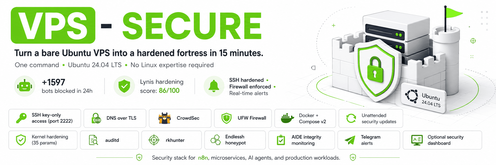
</p>


# One script. 15 minutes. Never think about it again.

---

## :shield: What makes this script different?

A bare or default-configured server is an easy target — visible and attackable within minutes.

**VPS-Secure** is not just an install script: it's a complete security stack that turns a naked VPS into a hardened, production-ready server — with SSH lockdown, crowdsourced intrusion detection, a honeypot, and real-time alerts. All automated. All in one command.

<p align="center">
  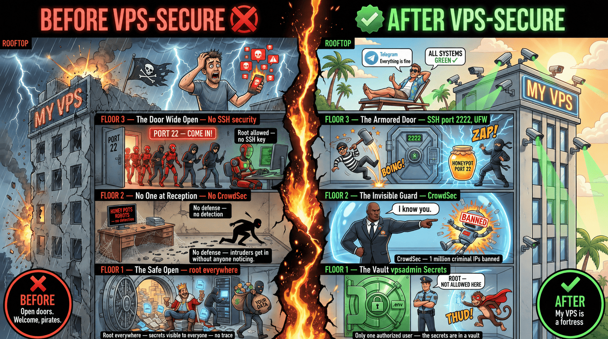
</p>
<p align="center">
  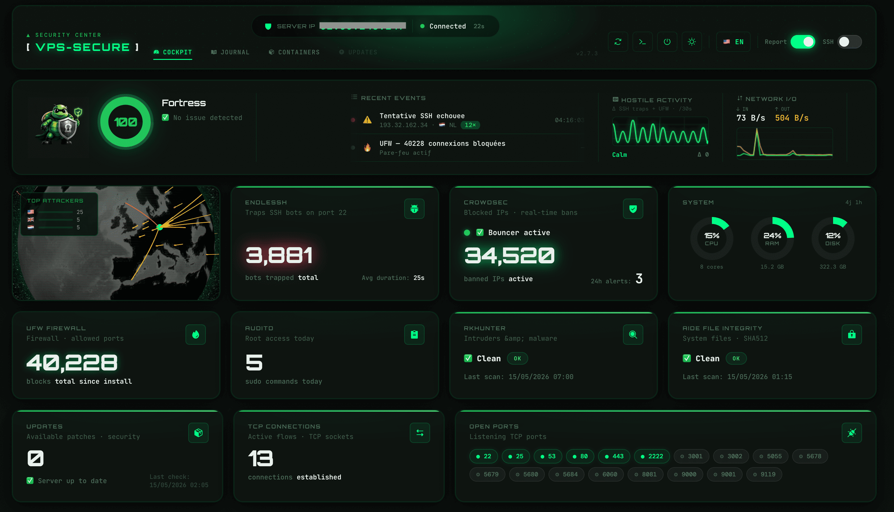
</p>

---

## Bare VPS vs. VPS-SECURE — The real difference

| | Bare VPS | VPS-SECURE |
|---|:---:|:---:|
| Default exposed ports | ❌ All | ✅ 3 only (2222 / 80 / 443) |
| Brute force protection | ❌ None | ✅ CrowdSec collaborative IPS |
| Port 22 bots | ❌ Active attack vector | ✅ Trapped for hours by Endlessh |
| SSH root login | ❌ Allowed | ✅ Permanently disabled |
| SSH authentication | ❌ Password (bruteforceable) | ✅ Key-only (ed25519) |
| Kernel hardening | ❌ 0 parameters | ✅ 35 sysctl parameters |
| Rootkit scanning | ❌ None | ✅ rkhunter — daily at 00:00 UTC |
| File integrity monitoring | ❌ None | ✅ AIDE — SHA512 baseline daily 03:00 |
| Docker firewall bypass | ❌ Exposed by default | ✅ Fixed — UFW has full control |
| Security alerts | ❌ None | ✅ Telegram — instant SSH + daily report |
| Automatic security patches | ❌ No | ✅ Yes — incl. Docker CE |
| Lynis hardening score | ❌ ~50 / 100 | ✅ **86 / 100** |
| Time to harden | ❌ Days of research | ✅ **15 minutes** |


---

## VPS-SECURE: One script. 15 minutes. Never think about it again.

```bash
curl -fsSL https://raw.githubusercontent.com/rockballslab/vps-secure/main/install-secure.sh -o install-secure.sh \
  && chmod +x install-secure.sh \
  && sudo ./install-secure.sh
```

> [!NOTE]
> :key: **This script requires a license** — [Get it here](https://vps-secure.aiforceone.fr/offre-en.html)
>
> :technologist: **Developer?** Want to audit or contribute to the code? [Request a free license](https://tally.so/r/Y5JGjJ) — activation key sent within minutes.

---

## 📋 Table of Contents

- [👋 Who built this?](#who-built-this)
- [⚙️ What VPS-SECURE does — 15 automated steps](#what-vps-secure-does)
- [⚡ Security responsiveness — live CVE patches](#shield-security-responsiveness)
- [✅ Requirements](#requirements)
- [🚀 Installation — step by step (15 min)](#automatic-installation-in-15-minutes-flat)
  - [Step 0 — Interactive guide *(recommended)*](#step-0--start-with-the-interactive-guide-recommended)
  - [Step 1 — Generate your SSH key](#step-1--generate-your-ssh-key-on-your-local-machine)
  - [Step 2 — Connect as root](#step-2--connect-as-root)
  - [Step 3 — Run the script](#step-3--run-the-script)
  - [Step 4 — Reconnect as vpsadmin](#step-4--reconnect-as-vpsadmin-after-reboot)
  - [Step 5 — Verify the installation](#step-5--verify-the-installation)
- [📲 Telegram alerts *(optional)*](#security-alerts-on-telegram-optional)
- [💡 Optional but useful — Quick connect](#optional-but-useful)
- [📊 Monitoring dashboard *(optional but recommended)*](#monitoring--optional-but-highly-recommended)
  - [Cockpit tab EN/FR](#cockpit-tab-enfr)
  - [Security log tab](#security-log-tab)
  - [Containers tab](#containers-tab)
  - [Tech stack](#tech-stack)
- [🔒 Security level — CIS · DISA STIG · Lynis 86/100](#shield-security-level)
- [👤 vpsadmin user security](#vpsadmin-user-security)
- [🚫 What this script does NOT do](#what-this-script-does-not-do)
- [🛠️ Useful commands after installation](#useful-commands-after-installation)
- [🖥️ Compatibility](#compatibility)
- [⚠️ Known limitations](#known-limitations)
- [📄 License](#license)
- [⭐ Star History](#star-history)

---

## Who built this?

:wave: Hey, I'm Fabrice.
Entrepreneur, SaaS founder, and Zero Trust advocate based in France.

I built **VPS-SECURE** out of necessity: I needed a tool that could harden any bare server in minutes, without breaking the services running on it.

> This is the exact setup I run in production: n8n stacks, microservices, and autonomous AI agents. I don't ship tools I don't trust with my own infrastructure.

This project took serious effort to get right. The depth of what it covers — and the quality of the result — is something I'm genuinely proud of. Built with focus, obsession for detail, and a lot of help from Claude and my team of AI agents on Dust.

---

## What VPS-SECURE does

1 command — 15 automatic steps — zero technical expertise required.

<p align="center">
  
</p>

| # | What | Why |
|---|---|---|
| 1 | Creates `vpsadmin` user | No more root — impossible to make a fatal mistake |
| 2 | SSH on port 2222, key-only | Connection restricted to `vpsadmin` only. **GSSAPI disabled** (CVE-2026-3497) |
| 3 | System update + encrypted DNS + `/tmp`, `/var/tmp` and `/dev/shm` secured | Closes known vulnerabilities. DNS over TLS activated **before** any download — eliminates the DNS poisoning window. `/tmp`, `/var/tmp` and `/dev/shm` mounted `noexec` — malicious scripts cannot execute there |
| 4 | **CrowdSec** | Detects and bans malicious IPs. Installed via GPG-signed repository with hardcoded fingerprint verification — integrity guaranteed |
| 5 | **UFW** (firewall) | Everything blocked except ports 2222, 80 and 443. Docker forwarding is targeted — not global |
| 6 | **Docker** Engine + Compose v2 | Docker runs applications in isolated containers. Configured to **not** bypass UFW — exposed ports remain under firewall control. NAT rule added in UFW — containers have internet access |
| 7 | unattended-upgrades | Security patches installed automatically every night. **Docker CE** included in automatic updates. **snapd blacklisted** (CVE-2026-3888) |
| 8 | Kernel hardening | **35 parameters**: network (spoofing, SYN flood, ICMP...) + ASLR + ptrace + core dumps + perf events + **AppArmor userns restriction (CIS compliance)** |
| 9 | **auditd** | Logs everything: SSH, sudo, Docker, sensitive files, crontabs, `/etc/hosts`. **Anti-rootkit monitoring** — daily `voidlink-detect` scan at 02:30 |
| 10 | 2 GB Swap | Emergency virtual memory — prevents crashes |
| 11 | **rkhunter** | Scans for backdoors and rootkits. Daily automated scan at **00:00 UTC** — independent of Telegram |
| 12 | Unnecessary services disabled | avahi, cups, bluetooth, ModemManager disabled — every active service = attack surface (CIS 2.x). Ctrl-Alt-Delete masked (DISA STIG) |
| 13 | **Telegram** alerts | Daily security report + instant alert on every SSH login |
| 14 | **Endlessh** (honeypot port 22) | SSH is on port 2222 — port 22 is free. Endlessh captures it and keeps bots connected for hours by sending an infinite SSH banner. They cannot attack elsewhere during that time |
| 15 | **AIDE** (integrity monitoring) | SHA512 hash of all system binaries at install time. Daily scan at 03:00 — any modification triggers an alert in the Telegram report |


<p align="center">
  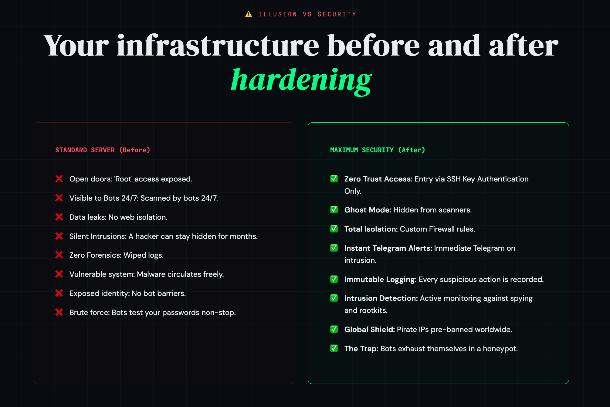
</p>
<p align="center">
  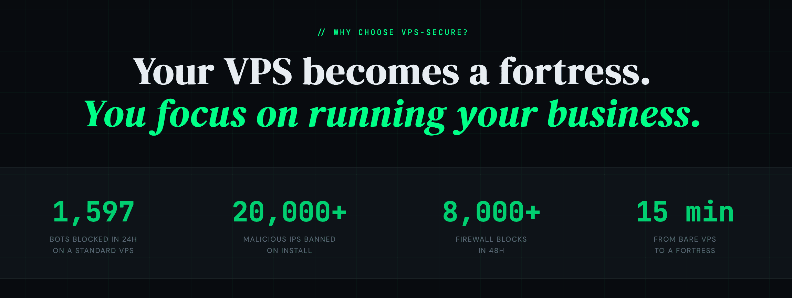
</p>

---

## Defense-in-depth architecture

Every incoming connection passes through a layered stack. An attacker must defeat **all layers sequentially** — missing one means they never reach your system.

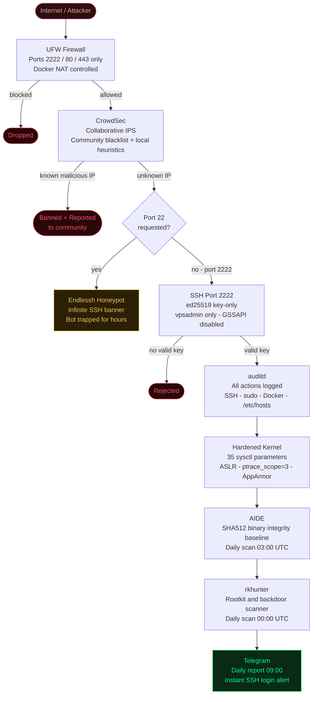
```mermaid
graph TD
    INTERNET(["Internet / Attacker"])

    INTERNET --> UFW["UFW Firewall<br/>Ports 2222 / 80 / 443 only<br/>Docker NAT controlled"]
    UFW -->|"blocked"| DROP1(["Dropped"])
    UFW -->|"allowed"| CROWDSEC["CrowdSec<br/>Collaborative IPS<br/>Community blacklist + local heuristics"]
    CROWDSEC -->|"known malicious IP"| DROP2(["Banned + Reported<br/>to community"])
    CROWDSEC -->|"unknown IP"| PORT22{"Port 22<br/>requested?"}
    PORT22 -->|"yes"| ENDLESSH["Endlessh Honeypot<br/>Infinite SSH banner<br/>Bot trapped for hours"]
    PORT22 -->|"no - port 2222"| SSH2222["SSH Port 2222<br/>ed25519 key-only<br/>vpsadmin only - GSSAPI disabled"]
    SSH2222 -->|"no valid key"| DROP3(["Rejected"])
    SSH2222 -->|"valid key"| AUDITD["auditd<br/>All actions logged<br/>SSH - sudo - Docker - /etc/hosts"]
    AUDITD --> KERNEL["Hardened Kernel<br/>35 sysctl parameters<br/>ASLR - ptrace_scope=3 - AppArmor"]
    KERNEL --> AIDE["AIDE<br/>SHA512 binary integrity baseline<br/>Daily scan 03:00 UTC"]
    AIDE --> RKHUNTER["rkhunter<br/>Rootkit and backdoor scanner<br/>Daily scan 00:00 UTC"]
    RKHUNTER --> TELEGRAM["Telegram<br/>Daily report 09:00<br/>Instant SSH login alert"]

    style INTERNET fill:#2a1010,color:#ff9999,stroke:#ff4d6d
    style DROP1 fill:#2a0808,color:#ff4d6d,stroke:#ff4d6d
    style DROP2 fill:#2a0808,color:#ff4d6d,stroke:#ff4d6d
    style DROP3 fill:#2a0808,color:#ff4d6d,stroke:#ff4d6d
    style ENDLESSH fill:#2a2005,color:#f0c060,stroke:#f0b429
    style TELEGRAM fill:#0a2a15,color:#00ff88,stroke:#00ff88
```

---

## :shield: Security responsiveness

> [!IMPORTANT]
> *"VPS-SECURE v2.7.5 — CVE-2026-46333 patched the same day it dropped.
> The 4th Linux kernel vulnerability of May 2026 — discovered by AI, leaks SSH host keys
> via a ptrace race. Fixed in one line. That's exactly why this product exists."*
>
> **CVE-2026-46333 "ssh-keysign-pwn"** — CVSS HIGH · Qualys TRU · Published 2026-05-15
>
> Vector: local information disclosure via ptrace dumpability race — leaks SSH host keys
> and `/etc/shadow` (Linux kernel 6.8.0, Ubuntu 24.04)
>
> Fix: `kernel.yama.ptrace_scope` bumped from `1` to `3` — integrated in `install.sh` step 8.

> [!IMPORTANT]
> *"VPS-SECURE v2.7.2 — CVE-2026-31431 patch integrated in under 24h — an actively
> exploited kernel vulnerability added to the CISA KEV list the day before."*
>
> **CVE-2026-31431 "Copy Fail"** — CVSS 7.8 · CISA KEV · Exploited in-the-wild
>
> Vector: local privilege escalation via `algif_aead` (Linux kernel 6.8.0, Ubuntu 24.04)
>
> Fix: permanent module blacklist via `modprobe.d` — integrated in `install.sh` step 8.


### CVE Response Timeline

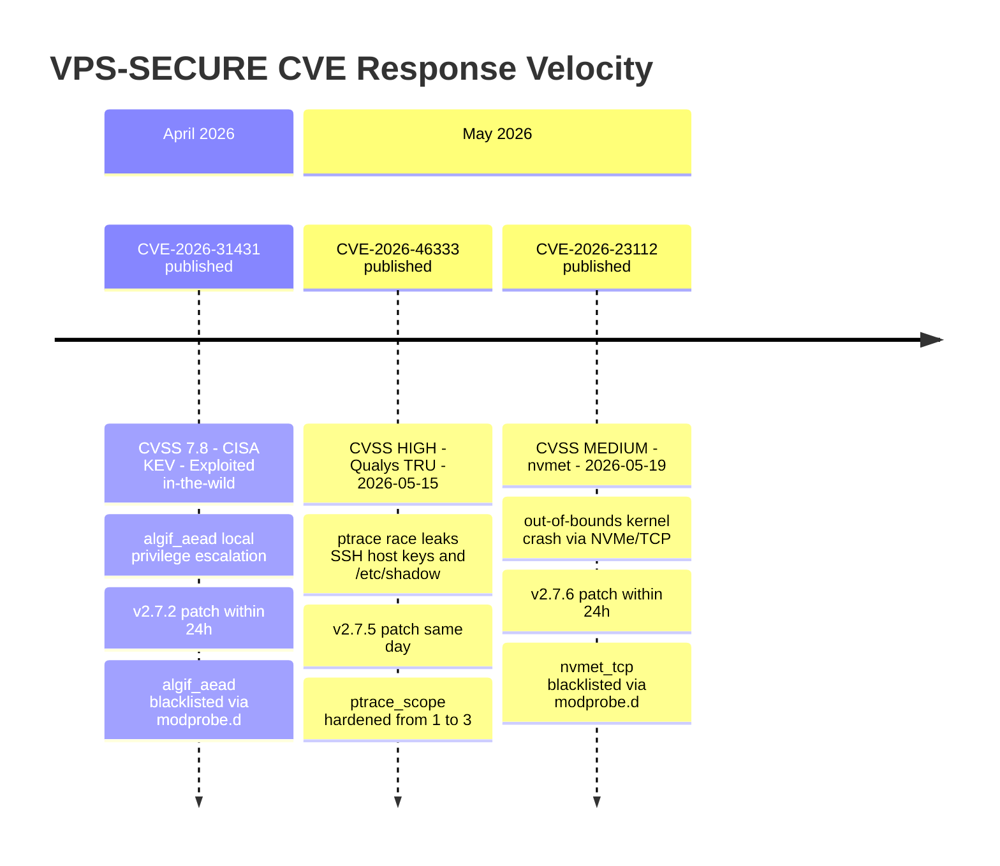
```mermaid
timeline
    title VPS-SECURE CVE Response Velocity
    section April 2026
        CVE-2026-31431 published : CVSS 7.8 - CISA KEV - Exploited in-the-wild
                                 : algif_aead local privilege escalation
                                 : v2.7.2 patch within 24h
                                 : algif_aead blacklisted via modprobe.d
    section May 2026
        CVE-2026-46333 published : CVSS HIGH - Qualys TRU - 2026-05-15
                                 : ptrace race leaks SSH host keys and /etc/shadow
                                 : v2.7.5 patch same day
                                 : ptrace_scope hardened from 1 to 3
        CVE-2026-23112 published : CVSS MEDIUM - nvmet - 2026-05-19
                                 : out-of-bounds kernel crash via NVMe/TCP
                                 : v2.7.6 patch within 24h
                                 : nvmet_tcp blacklisted via modprobe.d
```

---

## Requirements

Before running the script, you need:

- :white_check_mark: A fresh **Ubuntu 24.04 LTS** VPS — Hostinger, Hetzner, OVH, or any provider
- :white_check_mark: The **IP address** and **root credentials** from your hosting provider
- :white_check_mark: An **SSH key generated** on your local machine

> [!NOTE]
> :key: **This script requires a license** — [Get it here](https://vps-secure.aiforceone.fr/offre-en.html) — **LAUNCH OFFER 47€** instead of 97€ with code **REDUC50**
>
> :technologist: **Developer?** Want to audit or contribute to the code? [Request a free license](https://tally.so/r/Y5JGjJ) — activation key sent within minutes.

---

## Automatic installation in 15 minutes flat


```mermaid
flowchart LR
    A(["Bare VPS\nUbuntu 24.04"]) --> B["Step 0\nInteractive Guide"]
    B --> C["Step 1\nSSH Key Generation"]
    C --> D["Step 2\nConnect as root"]
    D --> E["Step 3\nRun install script"]
    E --> F["Step 4\nReconnect as vpsadmin"]
    F --> G["Step 5\nvps-secure-verify"]
    G --> H(["FORTRESS\nReady"])

    style A fill:#1a1a2e,color:#aaaacc,stroke:#444488
    style H fill:#0a2a18,color:#00ff88,stroke:#00cc66
```

### Step 0 — Start with the interactive guide *(recommended)*

Before anything else, open the [Interactive Installation Guide](https://vps-secure.aiforceone.fr/guide-en.html) and follow the steps.

It walks you through every input you'll need — no copy-paste errors, no back-and-forth.

> [!TIP]
> **No VPS yet?** [Hostinger — 20% off code **WP7SERVERWR1**](https://www.hostinger.com/fr?REFERRALCODE=WP7SERVERWR1) or [Hetzner — 20 EUR free credit](https://hetzner.cloud/?ref=9x8yLdZS8Btd)

---

### Step 1 — Generate your SSH key (on your local machine)

Open a terminal on your computer:
- **Mac** — Spotlight (`Cmd+Space`) — type `Terminal` — Enter
- **Windows** — `Windows` key — type `Windows Terminal` or `PowerShell` — Enter

Then run:
```bash
ssh-keygen -t ed25519 -f ~/.ssh/id_ed25519_vps
```

Press Enter 3 times to skip the passphrase (quick option).

> [!TIP]
> **Recommended:** set a strong passphrase at this step. If your private key is stolen,
> it will be unusable without this password.
> If you use ssh-agent, you will only type it once per session.

Retrieve your public key — you will need it during the script:
```bash
cat ~/.ssh/id_ed25519_vps.pub
```

Copy the output (it starts with `ssh-ed25519`) and paste it into the [Installation Guide](https://vps-secure.aiforceone.fr/guide-en.html).

---

### Step 2 — Connect as root

```bash
ssh root@YOUR_VPS_IP
```

Replace `YOUR_VPS_IP` with the IP you noted in the interactive guide.

The server will ask for a password — that's the root password provided by your hosting provider by email after provisioning.

> [!TIP]
> This is the only time this password is used. After installation, root password login is permanently disabled.

> [!TIP]
> If you have used this IP before (previous VPS rebuild), remove the old known key before connecting:
> ```bash
> ssh-keygen -R YOUR_VPS_IP
> ```

---

### Step 3 — Run the script

```bash
curl -fsSL https://raw.githubusercontent.com/rockballslab/vps-secure/main/install-secure.sh -o install-secure.sh \
  && chmod +x install-secure.sh \
  && sudo ./install-secure.sh
```

> [!IMPORTANT]
> **`install-secure.sh`** verifies the GPG signature of `install.sh` before running it.
> This is the recommended command — it guarantees the script has not been tampered with.

The script is interactive. It asks **3 mandatory questions** at the start of installation:

1. Your activation key (received by email)
2. Your public SSH key (paste the content of `id_ed25519_vps.pub`)
3. Confirm the connection works from a 2nd terminal

And **1 optional question** at the end: configure Telegram alerts.

> [!TIP]
> The interactive guide walks you through every step. Use it to copy-paste each value without errors.
>
> [Open the Installation Guide](https://vps-secure.aiforceone.fr/guide-en.html)

<p align="left">
  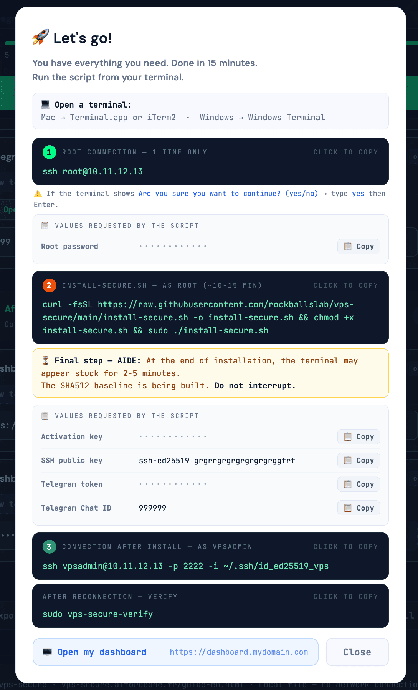
</p>

---

### Step 4 — Reconnect as vpsadmin (after reboot)

```bash
ssh vpsadmin@YOUR_VPS_IP -p 2222 -i ~/.ssh/id_ed25519_vps
```

Your VPS is secured. Time to verify everything is running.

---

### Step 5 — Verify the installation

The script displayed this command at the end — run it now:

```bash
sudo vps-secure-verify
```

Each component returns `[PASS]` or `[FAIL]` with the reason. Everything should be PASS.

```
  [PASS] SSH          : port 2222 active - root disabled - PasswordAuth off - socket override OK
  [PASS] UFW          : active - ports 2222/80/443 open - Docker NAT rule present - logging medium
  [PASS] CrowdSec     : active - bouncer active - port 8081 - 2 collection(s)
  [PASS] Docker       : active - v29.3.1 - iptables:false confirmed
  [PASS] Endlessh     : container active - port 22 listening - UFW rule present
  [PASS] AIDE         : baseline present (age: 0d) - cron 03:00 configured
  [PASS] rkhunter     : installed - baseline present - conf.local OK - cron 00:00 UTC - last scan: never
  [PASS] auditd       : active - 34 rule(s) loaded
  [PASS] Swap         : active - 2048 MB - swappiness=10
  [PASS] Kernel       : ASLR=2 - ptrace_scope=3 - syncookies=1 - ip_forward=1 - suid_dumpable=0
  [PASS] DNS over TLS : systemd-resolved active - DoT=yes - primary server: 9.9.9.9
  [PASS] Telegram     : config present - API OK - bot: @mybot

  Installation 100% complete — all components are operational.
```

That is IT. Done in under 15 minutes, fully automated.

Your VPS is now **SECURED**. It is officially a **FORTRESS**.

---

## Security alerts on Telegram (optional)

At the end of installation, the script offers two alert levels:

- **Daily report at 09:00** — global server status (CrowdSec, rkhunter, auditd)
- **Instant alert** — Telegram notification on every successful SSH login (user + source IP)

**What you need:**
1. Create a bot — open [@BotFather](https://t.me/BotFather) — `/newbot` — copy the token
2. Get your chat ID — open [@userinfobot](https://t.me/userinfobot) — `/start` — copy the `id`

**What you receive every morning at 09:00:**

```
[SECURE] vps-secure - Daily report
[DATE]   13/04/2026 - monvps

[OK] Everything looks good on your VPS

[OK] CrowdSec : no alerts
[OK] rkhunter : no anomaly
[i]  rkhunter baseline updated by apt on 2026-04-15T01:00:00Z
[OK] auditd   : no critical events
[HP] Endlessh : 247 bot(s) trapped in 24h
[OK] AIDE     : no system modification detected

No action required.
```

**What you receive on every SSH login:**

```
[SSH] Connection on monvps
User      : vpsadmin
Source IP : 92.184.x.x
Date      : 13/04/2026 14:32:17
```

If an anomaly is detected in the daily report, the message includes the details and the exact command to fix it.

---

> [!WARNING]
> **Docker and Firewall: The "UFW Bypass" — fixed**
>
> By default, Docker manipulates iptables and completely ignores your firewall (UFW) rules, exposing your ports directly to the internet. This script fixes this critical vulnerability present in virtually all standard installations.
>
> The fix: The script disables automatic iptables management by the Docker daemon (`iptables: false`).
>
> Internet access: A NAT rule (MASQUERADE) is automatically injected into before.rules so your containers keep outbound internet access (updates, APIs, etc.).
>
> Total control: Nothing gets in without your explicit approval.

Direct consequence: If you launch a container on port 8080, it will remain invisible from outside by default. To open it, you must do it manually:

```bash
sudo ufw allow 8080/tcp comment 'My application'
```

---

## Automated daily security schedule

Every night, while you sleep, VPS-SECURE runs a full security sweep autonomously.


```mermaid
gantt
    title VPS-SECURE - Automated Daily Security Jobs
    dateFormat HH:mm
    axisFormat %H:%M

    section Scans
    rkhunter rootkit scan           :00:00, 30m
    auditd voidlink-detect          :02:30, 15m
    AIDE file integrity check       :03:00, 45m

    section Maintenance
    unattended-upgrades             :02:00, 60m

    section Reports
    Telegram daily report           :09:00, 5m

    section Continuous
    CrowdSec active monitoring      :active, 00:00, 1440m
    Endlessh honeypot               :active, 00:00, 1440m
    Security stats cache 5min TTL   :crit,   00:00, 1440m
```

---

## Optional but useful

### Quick connect

> [!TIP]
> Add this on **your local machine** in `~/.ssh/config` to connect with just `ssh monvps`:
> ```
> Host monvps
>     HostName YOUR_VPS_IP
>     User vpsadmin
>     Port 2222
>     IdentityFile ~/.ssh/id_ed25519_vps
> ```

---

## Monitoring (optional but highly recommended)

A web **dashboard** to visualize your server's status in real time.

```bash
bash <(curl -fsSL https://raw.githubusercontent.com/rockballslab/vps-secure/main/dashboard/install-dashboard-secure.sh)
```

The script asks for a domain name and a password. Your password will be saved in `~/vps-monitor/.env`.

> [!NOTE]
> **Prerequisite:** a DNS A record pointing to your VPS IP.
> To generate a secure password: `openssl rand -base64 32`

<p align="center">
  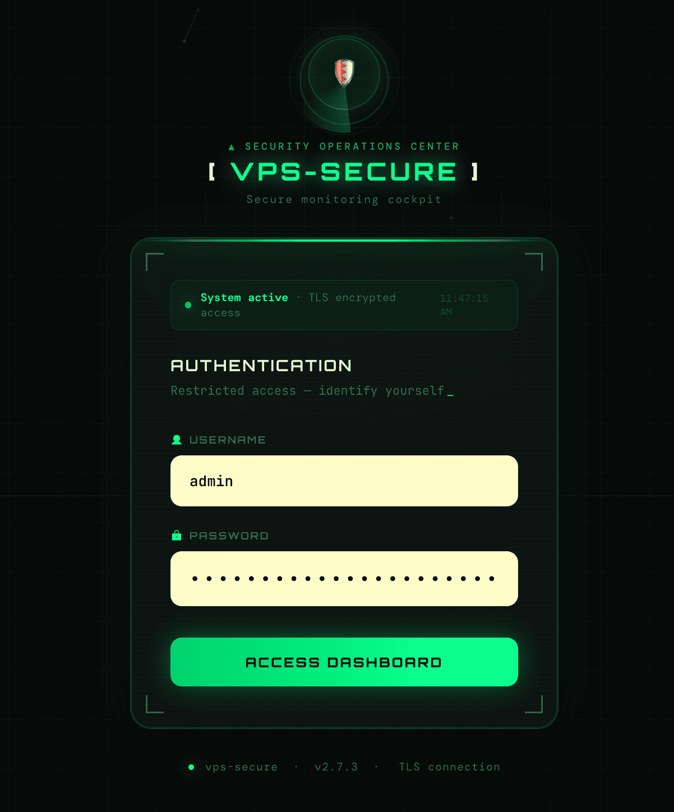
</p>

<p align="center">
  
</p>

### Cockpit tab EN/FR

Health score 0-100 with a secret mascot at perfect score.

| Card | What it measures |
|---|---|
| Threat Map | Interactive globe — real-time attack arcs · geolocated IPs (Endlessh + CrowdSec) |
| Endlessh | Total trapped bots · 24h · avg trap duration |
| CrowdSec | Active banned IPs · 24h alerts · iptables bouncer status |
| System | CPU · RAM · Disk (donuts) · uptime |
| UFW Firewall | Total blocks from logs |
| Auditd | Today's sudo escalations |
| rkhunter | Clean/alert status · last scan date |
| AIDE File Integrity | Binary SHA512 integrity · last scan date |
| Updates | Available apt packages · last check date |
| TCP Connections | Real-time established connections |
| Open Ports | Listening TCP ports · detection of unexpected ports |

Timeline of the last 25 security events with animated scrolling. Interactive Telegram toggles (09:00 report · SSH alert).

> **Threat Map** — zoom centered on the server, automatic rotation, mouse zoom enabled. Permanent starfield background. Red dots = active attack sources, green dot = server location. 5-min backend cache.

### Security log tab

All events over 1d / 7d / 30d: SSH attempts, UFW blocks, CrowdSec bans, rkhunter warnings, AIDE modifications, unexpected ports. IP geolocation with country flags. Wins/alerts filter.

### Containers tab

Automatic detection of all Docker containers via socket. Cards per service with live status (Running · Stopped · Unhealthy · Starting), CPU, RAM, exposed ports. Background version check via Docker Hub registry — **Up to date** or **Update available** badge (1h cache). Monitored services: n8n, Baserow, MinIO, PostgreSQL, Caddy.

### Tech stack

- Python stdlib backend — zero external dependencies
- HTTP Basic Auth + rate limiting + lockout
- TTL 30s cache, 24h history persisted on disk
- Vanilla HTML/CSS/JS frontend — Phosphor Icons, Chart.js, DM Sans
- Light/dark mode with persistence
- Caddy reverse proxy + automatic TLS

#### Component dependency map

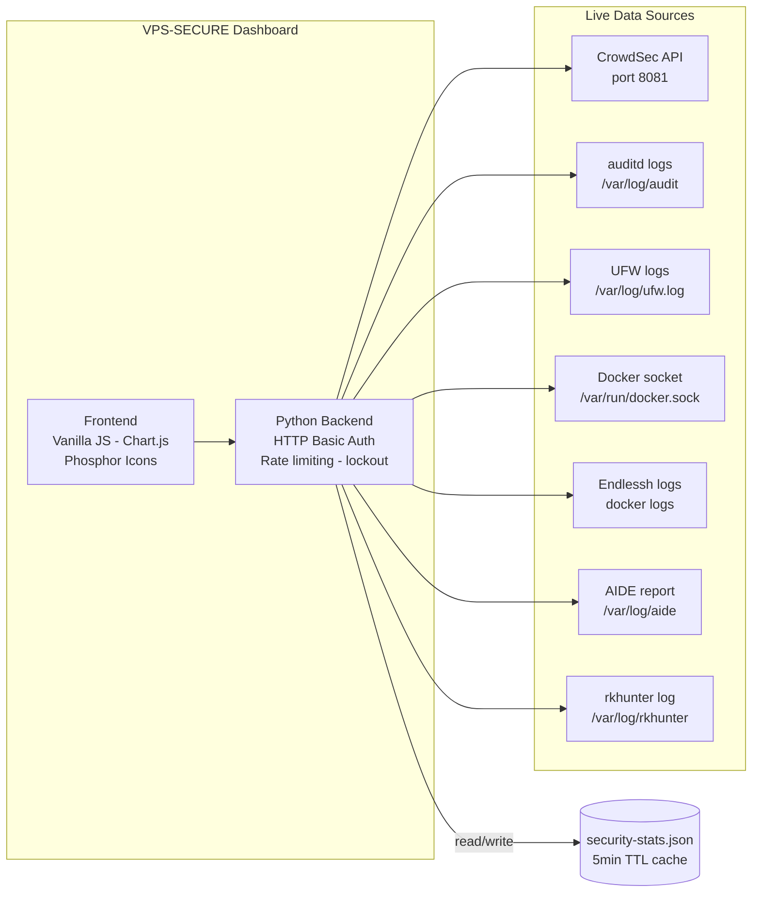
```mermaid
graph LR
    subgraph Dashboard["VPS-SECURE Dashboard"]
        UI["Frontend\nVanilla JS - Chart.js\nPhosphor Icons"]
        API["Python Backend\nHTTP Basic Auth\nRate limiting - lockout"]
    end

    subgraph DataSources["Live Data Sources"]
        CS["CrowdSec API\nport 8081"]
        AUDITD_LOG["auditd logs\n/var/log/audit"]
        UFW_LOG["UFW logs\n/var/log/ufw.log"]
        DOCKER_SOCK["Docker socket\n/var/run/docker.sock"]
        ENDLESSH_LOG["Endlessh logs\ndocker logs"]
        AIDE_LOG["AIDE report\n/var/log/aide"]
        RKH_LOG["rkhunter log\n/var/log/rkhunter"]
    end

    CACHE[("security-stats.json\n5min TTL cache")]

    UI --> API
    API --> CS
    API --> AUDITD_LOG
    API --> UFW_LOG
    API --> DOCKER_SOCK
    API --> ENDLESSH_LOG
    API --> AIDE_LOG
    API --> RKH_LOG
    API -->|"read/write"| CACHE
```

---

## :shield: Security level

<p align="left">
  
</p>

A bare VPS is a target. VPS-Secure turns it into a hardened, monitored, production-ready server — with a level of polish rarely found in a public script.

VPS-Secure does not "guarantee" absolute security — no serious tool can. Instead, it automates a complete and advanced hardening of Ubuntu 24.04 LTS, applying a large portion of the relevant controls from **CIS Benchmark Level 1** and **DISA STIG**, while remaining deployable on a standard VPS.

| Standard | What it is |
|---|---|
| CIS Benchmark L1 | Industry-recognized hardening baseline for production servers |
| DISA STIG Ubuntu 24.04 | A more demanding security level, inspired by the most controlled environments |
| OWASP Infrastructure | Special attention to supply chain, secrets, traceability and integrity |
| Lynis Audit | Open-source security audit tool that scans the system and produces a hardening score |

**CIS Benchmark L1** — The CIS Benchmark from the Center for Internet Security is a recognized reference for securing Linux systems. Level L1 targets a good balance between security and compatibility, making it a suitable baseline for production servers. VPS-Secure automates a large portion of the applicable controls for an Ubuntu 24.04 VPS, without imposing an overly heavy or restrictive configuration.

**DISA STIG** — The DISA STIG is a more demanding hardening framework, used in high-security contexts. Not all its controls apply to a standard VPS, but its general logic remains relevant for strengthening an internet-facing server. VPS-Secure applies this logic to go beyond basic hardening, while remaining deployable without enterprise infrastructure.

**Lynis** — Lynis is a widely-used Linux security audit tool among system administrators. It assigns a hardening score out of 100 and highlights configuration weaknesses. On a reference installation, VPS-Secure achieves a Lynis hardening index of **86/100** — a very high hardening level for a public VPS.

*Structural ceiling: certain controls (PIV/FIPS, DoD infrastructure) are out of scope for a public VPS.*

> [!NOTE]
> **What this covers concretely**
>
> The script establishes a coherent security foundation: hardened SSH access, firewall, intrusion detection, logging, system integrity, automatic updates and monitoring.
> The goal is to turn a bare VPS into a significantly more robust server from day one.
> This is not a comfort script: it's a serious security foundation for hosting applications, containers, or a SaaS.

### Security posture — VPS-SECURE vs. typical setups

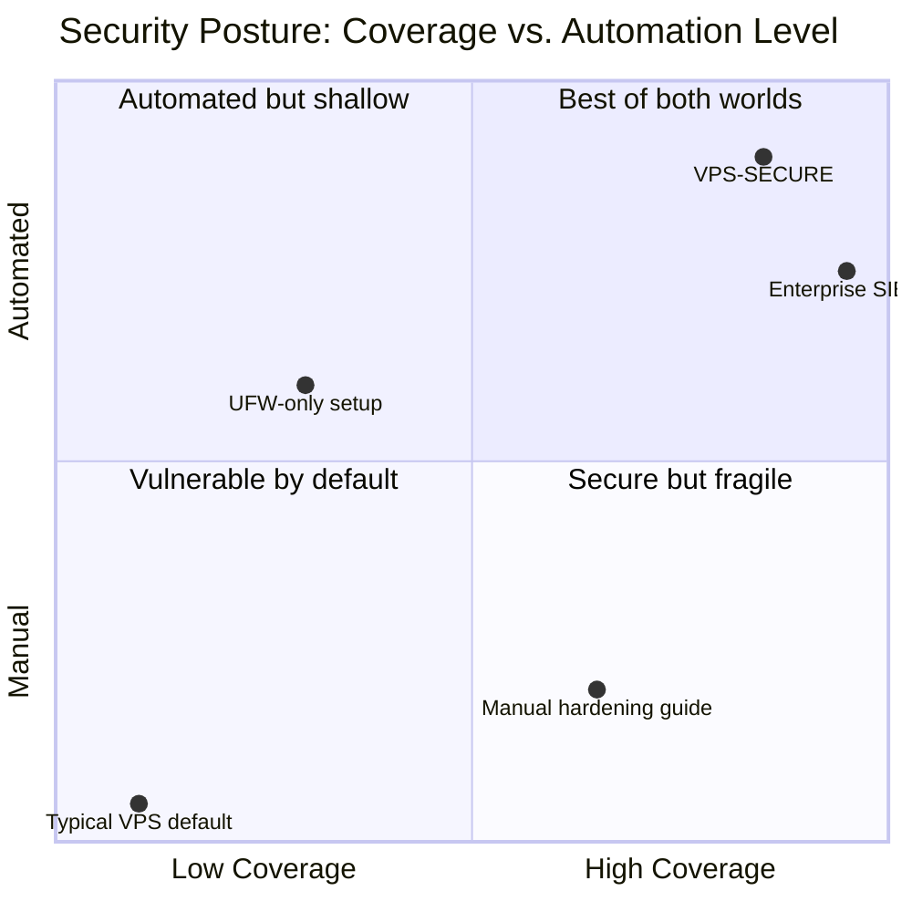
```mermaid
quadrantChart
    title Security Posture: Coverage vs. Automation Level
    x-axis Low Coverage --> High Coverage
    y-axis Manual --> Automated
    quadrant-1 Best of both worlds
    quadrant-2 Automated but shallow
    quadrant-3 Vulnerable by default
    quadrant-4 Secure but fragile
    VPS-SECURE: [0.85, 0.90]
    Typical VPS default: [0.10, 0.05]
    Manual hardening guide: [0.65, 0.20]
    Enterprise SIEM: [0.95, 0.75]
    UFW-only setup: [0.30, 0.60]
```

---

## vpsadmin user security

The script creates a dedicated user, vpsadmin, for day-to-day server administration. This avoids using the root account for routine tasks and reduces the risk of human error.

- **Simplified sudo**: vpsadmin can run admin commands without retyping their password each time. An additional configuration (`use_pty`) strengthens the security of this delegation.

- **Docker** implies privilege escalation: since vpsadmin can run Docker, they have a potentially very high level of control over the server. This is normal — it is the necessary trade-off for easily managing containers on a VPS.

> [!WARNING]
> **The golden rule: Protect your SSH key!**
> Whoever holds vpsadmin's private SSH key effectively has administrative access to the server.
> - Never store this private key on a public cloud.
> - Never share it.
> - Use a trusted machine for administrative access.

---

## What this script does NOT do

- **No application deployment** (n8n, WordPress, etc).
The script sets up a hardened infrastructure. Once the script runs, your server is a fortress ready to host your services. You install your apps — they will automatically benefit from the system's protection (Firewall, CrowdSec, etc.).

- **No HTTPS management** for your future sites.
The script does not guess your domain names. To put your own sites on HTTPS, you will need to install a Reverse Proxy (such as Caddy, Nginx Proxy Manager, or Traefik).

> Note: If you choose the Dashboard option, HTTPS is managed automatically with a Caddy Reverse Proxy.

---

## Useful commands after installation

### Diagnostics

```bash
# Full installation check (12 checks)
sudo vps-secure-verify
```

```bash
# Instant security dashboard
sudo vps-secure-stats
```

---

### Intrusion Detection (CrowdSec)

```bash
# View alerts from the last 24h
sudo cscli alerts list --since 24h
```

```bash
# Manually ban an IP
sudo cscli decisions add --ip 1.2.3.4 --reason "manual ban" --duration 24h
```

---

### Integrity and Rootkit

```bash
# Run a manual rootkit scan
sudo rkhunter --check --report-warnings-only
```

```bash
# View the daily rkhunter scan log (00:00 UTC)
sudo cat /var/log/rkhunter-cron.log
```

```bash
# Check if rkhunter was updated by apt
sudo cat /var/log/rkhunter-propupd.log
```

```bash
# AIDE — run a manual integrity scan
sudo /usr/local/bin/vps-secure-aide-check.sh
```

```bash
# AIDE — update the baseline after apt upgrade
sudo vps-secure-aide-rebase
```

---

### Firewall

```bash
# Firewall status
sudo ufw status verbose
```

```bash
# Open a port for an app (e.g. n8n on 8080)
sudo ufw allow 8080/tcp comment 'My application'
```

---

### Audit Logs

```bash
# Privilege escalations today
sudo ausearch -k privilege_escalation --start today -i
```

```bash
# Docker socket usage today
sudo ausearch -k docker_socket --start today -i
```

```bash
# Auditd summary report
sudo aureport --summary
```

---

### Telegram

```bash
# Test the Telegram report manually
sudo /usr/local/bin/vps-secure-check.sh
```

```bash
# Change the daily report time (e.g. 08:00 instead of 09:00)
sudo sed -i 's/^0 [0-9]* \* \* \*/0 8 * * */' /etc/cron.d/vps-secure
sudo cat /etc/cron.d/vps-secure
```

---

### Docker

```bash
# Endlessh honeypot — live logs
sudo docker logs -f endlessh
```

```bash
# Check ports exposed by Docker
sudo docker ps --format "table {{.Names}}\t{{.Ports}}"
```

---

### Cache and Misc

```bash
# Security cache (Endlessh + CrowdSec) — updated every 5 min
cat /var/cache/vps-secure/security-stats.json
```

---

## Compatibility

Tested and verified on May 22, 2026 on **Ubuntu 24.04 LTS** — **v2.7.8** — Hostinger KVM4 and Hetzner CPX42

Full installation 100% functional in **13 min** (dashboard installation included)

---

## Known limitations

- **CrowdSec + Caddy**: CrowdSec has no native Caddy log parser (`crowdsecurity/caddy` does not exist in the official hub). SSH and community-reputation blocking are fully active. HTTP application traffic is not behaviorally analyzed until a custom Caddy parser or Coraza WAF is configured.

---

## Star History

If VPS-SECURE saved your server, a star goes a long way. It helps other developers find this project and keeps the patches coming.

[](https://github.com/rockballslab/vps-secure)

---

## Frequently Asked Questions

<details>
<summary>Click to expand</summary>

**Q: Does this work on non-Ubuntu systems?**

A: Currently only Ubuntu 24.04 LTS is officially supported and tested. Other Debian-based distributions may work but are not guaranteed.

**Q: Will this break my existing services?**

A: No — the script hardens the OS layer without touching running applications. Docker containers continue to work. Only ports 2222/80/443 remain open by default. Any additional port your apps need must be explicitly opened with `ufw allow`.

**Q: Can I run this on an existing (non-fresh) VPS?**

A: It is designed for fresh installs. Running on an existing server is possible but proceed with caution — review each step in the interactive guide first, and make sure your current SSH setup will not lock you out.

**Q: What happens if my SSH connection drops during installation?**

A: The script asks you to confirm connectivity from a 2nd terminal before disabling root access. This safety net is built-in — you confirm the new SSH connection works before the old one is closed.

**Q: Does the script store my activation key?**

A: The key is verified online at install time and is not stored on the server afterward.

**Q: How do I open a port for a new application after installation?**

A: `sudo ufw allow YOUR_PORT/tcp comment 'App name'` — Docker containers also benefit automatically once the port is open in UFW.

**Q: What is the difference between rkhunter, AIDE, and CrowdSec?**

A: They operate at different layers. **CrowdSec** stops attacks at the network edge in real time. **rkhunter** scans for known rootkits and backdoors on disk. **AIDE** detects any modification to system binaries using SHA512 hashes — it catches what the others miss, such as a sophisticated backdoor that evades signature detection.

</details>

---

## License

VPS-SECURE COMMERCIAL LICENSE
Copyright (c) 2026 AIFORCEONE
https://vps-secure.aiforceone.fr/offre-en.html

---

*Made with love by Fabrice [@rockballslab](https://github.com/rockballslab) — part of AIFORCEONE*
